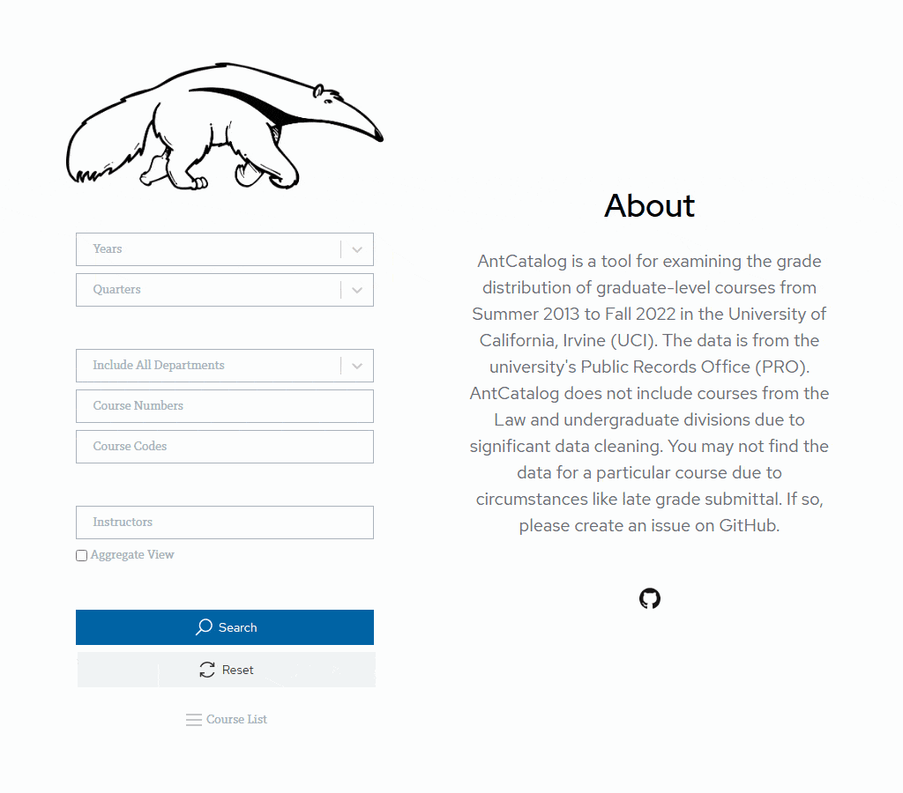

# AntCatalog
*This repository will no longer to be maintained after the 2022-2023 academic year. Please check out [PeterPortal](https://github.com/icssc) from now on.*

## Getting Started
Before moving on in this section, please install npm as well as the most current release of Node.js v18. It is recommended to follow the tutorial [here](https://www.youtube.com/watch?v=ohBFbA0O6hs).

### Front end
1. Enter the `client` folder in the command line and run `npm i` to install the packages
2. Execute `npm start` to see the front end application

### Back end
1. Enter the `server` folder in the command line and run `npm i` to install the packages
2. Execute `npm run dev` to start the back end service
   + If there is an error about ts-node, run `npm i -g ts-node`

For other information of back end services such as testing, please visit [here](https://github.com/imliuyzh/AntCatalog/tree/main/server). 

## Built With
### Front end
+ Ant Design Charts
+ Emotion
+ Lodash
+ PatternFly
+ React
+ React Router
+ React Select
+ Redux Toolkit

### Back end
+ Express.js
  + apicache
  + Express Rate Limit
  + express-validator
  + Helmet
  + node-cache
+ Fuse.js
+ Jest
  + ts-jest
+ Node.js
+ Nodemon
+ Sequelize
  + sqlite3
+ SuperTest
+ TypeScript
  + ts-node
+ winston

AntCatalog also uses Locust for load testing, which itself is written in Python.

## Deployment
You can use AWS EC2 or Azure App Service to deploy the application. If there is a problem with the instructions, please feel free to create an issue.

### Amazon Elastic Compute Cloud (EC2)
The instruction below is written for an AWS EC2 instance with Ubuntu v20.04 or v22.04 installed. Please ensure your operating system is able to initiate a SSH/SCP session.

1. Create an instance on EC2 like [this](https://www.youtube.com/watch?v=GEVbYQWWJkQ)
   + Restrict SSH access to your IP address only and allow HTTP/HTTPS connections from everywhere with the security group feature
2. Connect to the AWS instance you just created with `ssh -i "PEM_FILE_HERE" ubuntu@AWS_INSTANCE_PUBLIC_IPV4_DNS`
3. Follow [this tutorial](https://www.youtube.com/watch?v=ohBFbA0O6hs) to install nvm and the most current release of Node.js v18
4. Clone the project to the instance and run `npm ci` for both `client` and `server`
5. Execute `npm run build` on `client`
   + If there is a memory error, you can run `npm run build` locally and move the `build` folder to `client` on the server
6. Run `sudo apt install nginx` to install NGINX
   + Run `sudo service nginx stop` and `sudo rm /etc/nginx/sites-available/default`
   + Run `sudo touch /etc/nginx/sites-available/default`
   + Paste the code snippet below into the file you just created and make necessary adjustments
      ```
      server {
          listen 80;
          server_name your_domain.com www.your_domain.com;
          location / {
              proxy_pass http://127.0.0.1:26997;
              proxy_http_version 1.1;
              proxy_set_header Upgrade $http_upgrade;
              proxy_set_header Connection 'upgrade';
              proxy_set_header Host $host;
              proxy_set_header X-Forwarded-For $remote_addr;
              proxy_cache_bypass $http_upgrade;
              proxy_redirect off;
          }
      }
      ```
7. Run `npm install pm2 -g` and `pm2 startup`
   + Copy and paste the generated command to ensure pm2 is started automatically when the system is booted
8. Install Certbot to enable HTTPS by `sudo snap install --classic certbot`
9. Inject HTTPS settings into current NGINX setting with `sudo certbot --nginx` and answer the questions based on your circumstances
    + Renew the SSL certificate by `sudo certbot renew`
    + You can also automate the renewal by replacing the content in `/etc/cron.d/certbot`
      ```
      SHELL=/bin/sh
      PATH=/usr/local/sbin:/usr/local/bin:/sbin:/bin:/usr/sbin:/usr/bin

      0 */12 * * * root certbot -q renew --nginx
      ```
10. Execute `npm run build`, `npm run start:aws`, and `sudo service nginx start` on `server`

You should see the website deployed when you entered the public IPv4 address of the instance.

### Azure App Service
The instruction below is written for a Linux free tier instance. You can create one by following [this video](https://www.youtube.com/watch?v=npI4GD8mFuA). 

1. Go to the configuration page of the instance
   + Under `Application settings`, add `WEBSITE_WEBDEPLOY_USE_SCM` to application setting and set it to true
   + Under `General settings`, set the startup command to `npm run start:azure`, disable FTP state, set HTTP version to 2.0 with TLS version 1.2, turn off ARR affinity, and enable HTTPS only
2. Create a GitHub secret using a publish profile by following the sections "Generate deployment credentials" and "Configure the GitHub secret" in [this link](https://learn.microsoft.com/en-us/azure/app-service/deploy-github-actions)
3. Change the value of `AZURE_WEBAPP_NAME` in `github/workflows/deploy.yml` to the name of your instance
4. The application should be deployed whenever a new commit is pushed to the main branch
   + You can run the deployment workflow manually by following [this link](https://docs.github.com/en/actions/managing-workflow-runs/manually-running-a-workflow)

You should see the website deployed on `https://<app-name>.azurewebsites.net`. Note that it will take about a minute to load the website again after 20 minutes of inactivity. However, a workaround is implemented with the cron job in `github/workflows/poll.yml`.

## Acknowledgments
This project has inspirations from [ZotCurve](https://github.com/ZotCurve/ZotCurve.github.io) and the grade distribution data is from UC Irvine's Public Records Office (PRO).
